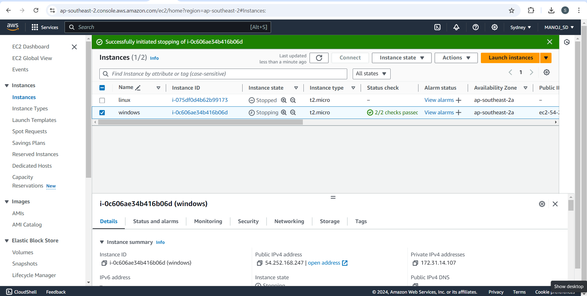

# Ex No 2: CLOUD-STORAGE-CREATION-S3-AND-LAUNCHING-AN-EC2-INSTANCE-IN-AWS-

### NAME: Manoj S  
### REG NO: 212222100025

# Aim:
To create a Simple Storage Service (S3) in AWS and to launch an EC2 instance in AWS.

# Procedure
a) Steps to Create a first S3 Bucket:

Step 1: Sign in to the AWS Management Console Go to https://console.aws.amazon.com/s3. 

Step 2: Open the S3 Service In the console, type S3 in the search bar and select S3 to open the service dashboard. 

Step 3: Create Bucket Click the Create bucket button. 

Step 4: Configure Bucket Settings

• Bucket name: Choose a globally unique name. • AWS Region: Select the region where you want to store your data.

Step 5: Object Ownership Choose between: ▪ ACLs disabled (recommended) – Bucket owner has full control. ▪ ACLs enabled – Control access via access control lists.

Step 6: Block Public Access Settings By default, all public access is blocked. Leave it as-is unless you need public access. 

Step 7: Bucket Versioning (optional) Choose whether to enable versioning for objects in the bucket.

Step 8: Encryption (optional) Select encryption options (SSE-S3, SSE-KMS, or none). 

Step 9: Advanced Settings (optional) Add tags, configure logging, etc. 

Step 10: Create the Bucket Click Create bucket at the bottom of the page.

b) i. Steps to launch an EC2 Instance

Go to the EC2 Dashboard in AWS Console.

Click on “Launch Instance”.

Choose an Amazon Machine Image (AMI) (e.g., Amazon Linux).

Select an instance type (e.g., t2.micro for Free Tier).

Create or choose a key pair for SSH access.

Configure network settings (use default VPC/subnet).

Configure storage (default root volume is fine).

Review the settings and click “Launch Instance”.

Wait for the instance to enter the running state.

c) Step 3: Connect to Your Instance

• Linux: Use SSH command with your .pem key. • Windows: Use RDP with decrypted admin password.

d) Steps to Clean Up (Terminate the Instance)

Go to EC2 Instances.
Select your instance → Instance State → Terminate.

# Output:

Simple Storage Service:

EC2(Elastic Cloud Compute)

# Result:
Thus, a Simple Storage Service (S3) and EC2 (Elastic Compute Cloud) - instance has been successfully created and launched in AWS

